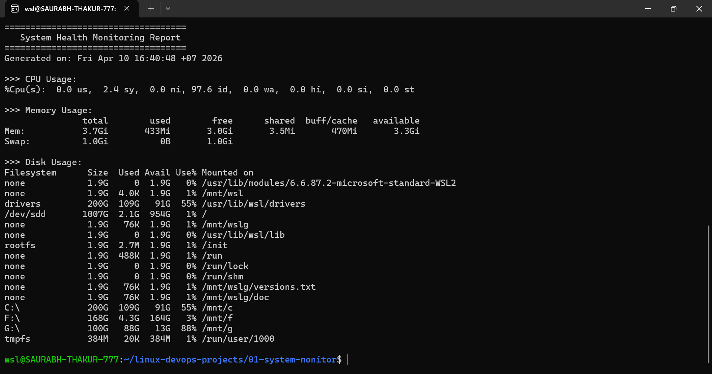

# System Monitoring Script

## Description
This project monitors system health including CPU, memory, and disk usage using a Bash script.

## Features
- CPU usage monitoring
- Memory usage monitoring
- Disk usage monitoring
- Generates report file

## Tech Stack
- Linux
- Bash Scripting
## Goal
To automate system monitoring and generate a report of CPU, memory, and disk usage, helping in basic system administration and performance tracking.
## How to Run
```bash
chmod +x monitor.sh
./monitor.sh
## Screenshot

